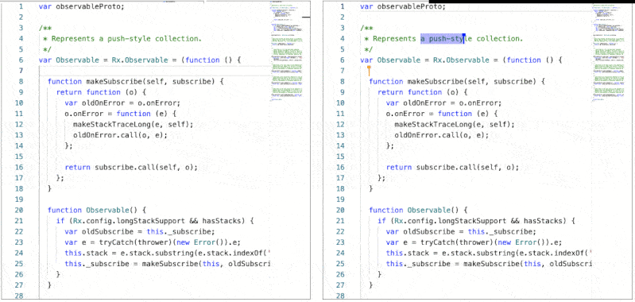

## Monaco Collaborative Extensions
[](https://travis-ci.org/convergencelabs/monaco-collab-ext)

Enhances the [Monaco Editor](https://github.com/Microsoft/monaco-editor) by adding the ability to render cues about what remote users are doing in the system.



## Installation

Install package with NPM and add it to your development dependencies:

```npm install --save-dev @convergencelabs/monaco-collab-ext```

## Demo
Go [here](https://examples.convergence.io/examples/monaco/) to see a live demo of multiple cursors, multiple selections, and remote scrollbars (Visit on multiple browsers, or even better, point a friend to it too).  This uses [Convergence](https://convergence.io) to handle the synchronization of data and user actions. 

## Usage

### RemoteCursorManager
The RemoteCursorManager allows you to easily render the cursors of other users
working in the same document.  The cursor position can be represented as either
a single linear index or as a 2-dimensional position in the form of
```{lineNumber: 0, column: 10}```.

```JavaScript
const editor = monaco.editor.create(document.getElementById("editor"), {
  value: "function helloWorld = () => { console.log('hello world!')",
  theme: "vs-dark'",
  language: 'javascript'
});

const remoteCursorManager = new MonacoCollabExt.RemoteCursorManager({
  editor: editor,
  tooltips: true,
  tooltipDuration: 2
});

const cursor = remoteCursorManager.addCursor("jDoe", "blue", "John Doe");

// Set the position of the cursor.
cursor.setOffset(4);

// Hide the cursor
cursor.hide();

// Show the cursor
cursor.show();

// Remove the cursor.
cursor.dispose();
```

### RemoteSelectionManager
The RemoteSelectionManager allows you to easily render the selection of other
users working in the same document.

```JavaScript
const editor = monaco.editor.create(document.getElementById("editor"), {
  value: "function helloWorld = () => { console.log('hello world!')",
  theme: "vs-dark'",
  language: 'javascript'
});

const remoteSelectionManager = new MonacoCollabExt.RemoteSelectionManager({editor: editor});

const selection = remoteSelectionManager.addSelection("jDoe", "blue");

// Set the range of the selection using zero-based offsets.
selection.setOffsets(45, 55);

// Hide the selection
selection.hide();

// Show the selection
selection.show();

// Remove the selection.
selection.dispose();
```

### EditorContentManager 
The EditorContentManager simplifies dealing with local and remote changes
to the editor.

```JavaScript
const editor = monaco.editor.create(document.getElementById("editor"), {
  value: "function helloWorld = () => { console.log('hello world!')",
  theme: "vs-dark'",
  language: 'javascript'
});

const contentManager = new MonacoCollabExt.EditorContentManager({
  editor: editor,
  onInsert(index, text) {
    console.log("Insert", index, text);
  },
  onReplace(index, length, text) {
    console.log("Replace", index, length, text);
  },
  onDelete(index, length) {
    console.log("Delete", index, length);
  }
});

// Insert text into the editor at offset 5.
contentManager.insert(5, "some text");

// Replace the text in the editor at range 5 - 10.
contentManager.replace(5, 10, "some text");

// Delete the text in the editor at range 5 - 10.
contentManager.delete(5, 10);

// Release resources when done
contentManager.dispose();
```
